## AUTHOR

- [Francesco Zubani](https://www.linkedin.com/in/francesco-zubani-5957081a6/)

## AKNOWLEDGEMENTS

Only FOSS software was used to generate the gallery.

This work was made possible by the following projects:

- [Stable Diffusion](https://github.com/CompVis/stable-diffusion) - [LICENSE](https://github.com/CompVis/stable-diffusion/blob/main/LICENSE)
- [ComfyUI](https://github.com/comfyanonymous/ComfyUI) - [LICENSE](https://github.com/comfyanonymous/ComfyUI/blob/master/LICENSE)
- [GIMP](https://www.gimp.org/)
- [Inkscape](https://inkscape.org/)

The cover's frame and logo were made by Daniele Galano.

This work is licensed under the GPLv3 license.
See LICENSE file for more details.

## GALLERY

### Generazione casuale di numeri

  <a href="PIC132_01.png">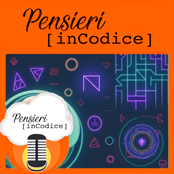</a>
  
  <a href="PIC132_03.png">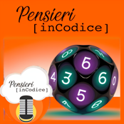</a>
  
  <a href="PIC132_05.png">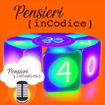</a>
  <a href="PIC132_06.png">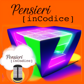</a>
  <a href="PIC132_07.png">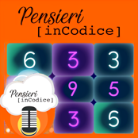</a>
  <a href="PIC132_08.png">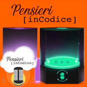</a>
  
  <a href="PIC132_10.png">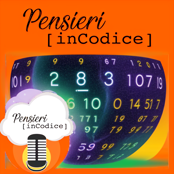</a>
  <a href="PIC132_11.png">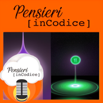</a>
  <a href="PIC132_12.png">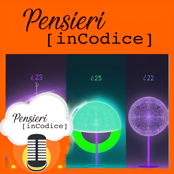</a>
  <a href="PIC132_13.png">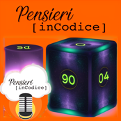</a>
  
  
  <a href="PIC132_16.png">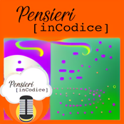</a>
  
  <a href="PIC132_18.png">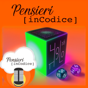</a>
  
  <a href="PIC132_20.png">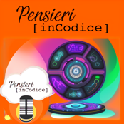</a>

</body>
</html>
