## AUTHOR

- [Francesco Zubani](https://www.linkedin.com/in/francesco-zubani-5957081a6/)

## AKNOWLEDGEMENTS

Only FOSS software was used to generate the gallery.

This work was made possible by the following projects:

- [Stable Diffusion](https://github.com/CompVis/stable-diffusion) - [LICENSE](https://github.com/CompVis/stable-diffusion/blob/main/LICENSE)
- [ComfyUI](https://github.com/comfyanonymous/ComfyUI) - [LICENSE](https://github.com/comfyanonymous/ComfyUI/blob/master/LICENSE)
- [GIMP](https://www.gimp.org/)
- [Inkscape](https://inkscape.org/)

The cover's frame and logo were made by Daniele Galano.

This work is licensed under the GPLv3 license.
See LICENSE file for more details.

## GALLERY

### Gli strati del Web

  
  
  
  
  
  <a href="PIC6_06.png">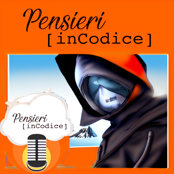</a>
  <a href="PIC6_07.png">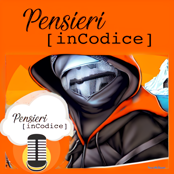</a>
  <a href="PIC6_08.png">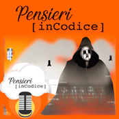</a>
  <a href="PIC6_09.png">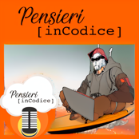</a>
  <a href="PIC6_10.png">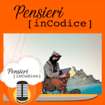</a>
  <a href="PIC6_11.png">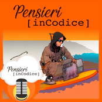</a>
  <a href="PIC6_12.png">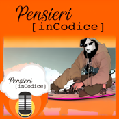</a>
  <a href="PIC6_13.png">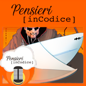</a>
  <a href="PIC6_14.png">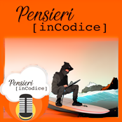</a>
  
  <a href="PIC6_16.png">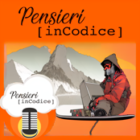</a>
  <a href="PIC6_17.png">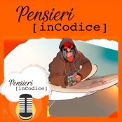</a>
  <a href="PIC6_18.png">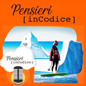</a>
  <a href="PIC6_19.png">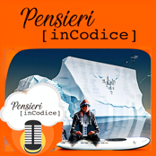</a>
  <a href="PIC6_20.png">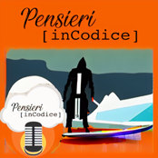</a>
  <a href="PIC6_21.png">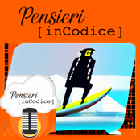</a>
  
  <a href="PIC6_23.png">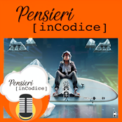</a>
  <a href="PIC6_24.png">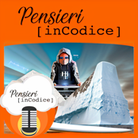</a>
  <a href="PIC6_25.png">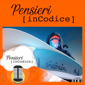</a>
  <a href="PIC6_26.png">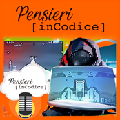</a>
  <a href="PIC6_27.png">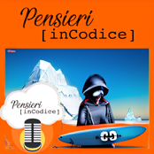</a>
  <a href="PIC6_28.png">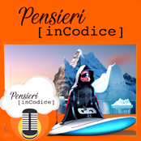</a>
  <a href="PIC6_29.png">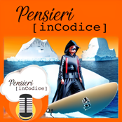</a>
  <a href="PIC6_30.png">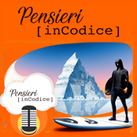</a>
  <a href="PIC6_31.png">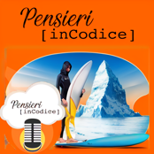</a>
  <a href="PIC6_32.png">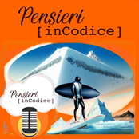</a>

</body>
</html>
