## AUTHOR

- [Francesco Zubani](https://www.linkedin.com/in/francesco-zubani-5957081a6/)

## AKNOWLEDGEMENTS

Only FOSS software was used to generate the gallery.

This work was made possible by the following projects:

- [Stable Diffusion](https://github.com/CompVis/stable-diffusion) - [LICENSE](https://github.com/CompVis/stable-diffusion/blob/main/LICENSE)
- [ComfyUI](https://github.com/comfyanonymous/ComfyUI) - [LICENSE](https://github.com/comfyanonymous/ComfyUI/blob/master/LICENSE)
- [GIMP](https://www.gimp.org/)
- [Inkscape](https://inkscape.org/)

The cover's frame and logo were made by Daniele Galano.

This work is licensed under the GPLv3 license.
See LICENSE file for more details.

## GALLERY

### Un hacker non è un criminale

  
  <a href="PIC66_03.png">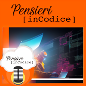</a>
  <a href="PIC66_04.png">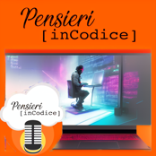</a>
  
  <a href="PIC66_06.png">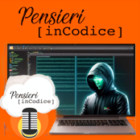</a>
  
  <a href="PIC66_08.png">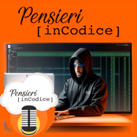</a>
  <a href="PIC66_09.png">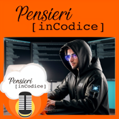</a>
  <a href="PIC66_10.png">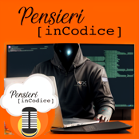</a>
  <a href="PIC66_11.png">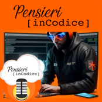</a>
  <a href="PIC66_12.png">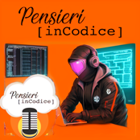</a>
  <a href="PIC66_13.png">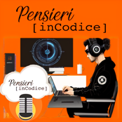</a>
  <a href="PIC66_14.png">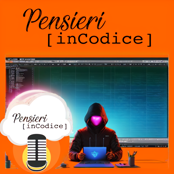</a>
  
  <a href="PIC66_16.png">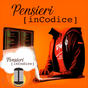</a>
  <a href="PIC66_17.png">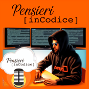</a>
  <a href="PIC66_18.png">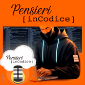</a>
  <a href="PIC66_19.png">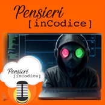</a>
  
  <a href="PIC66_21.png">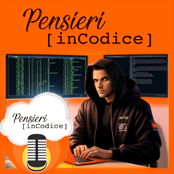</a>

</body>
</html>
