## AUTHOR

- [Francesco Zubani](https://www.linkedin.com/in/francesco-zubani-5957081a6/)

## AKNOWLEDGEMENTS

Only FOSS software was used to generate the gallery.

This work was made possible by the following projects:

- [Stable Diffusion](https://github.com/CompVis/stable-diffusion) - [LICENSE](https://github.com/CompVis/stable-diffusion/blob/main/LICENSE)
- [ComfyUI](https://github.com/comfyanonymous/ComfyUI) - [LICENSE](https://github.com/comfyanonymous/ComfyUI/blob/master/LICENSE)
- [GIMP](https://www.gimp.org/)
- [Inkscape](https://inkscape.org/)

The cover's frame and logo were made by Daniele Galano.

This work is licensed under the GPLv3 license.
See LICENSE file for more details.

## GALLERY

### Snippet - Dallo Sputnik al Lo...gin

  <a href="PIC76_01.png">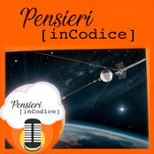</a>
  <a href="PIC76_02.png">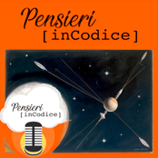</a>
  <a href="PIC76_03.png">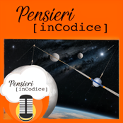</a>
  <a href="PIC76_04.png">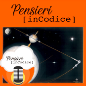</a>
  <a href="PIC76_05.png">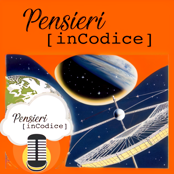</a>
  <a href="PIC76_06.png">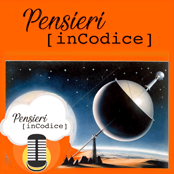</a>
  <a href="PIC76_07.png">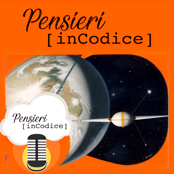</a>
  <a href="PIC76_08.png">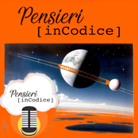</a>
  <a href="PIC76_09.png">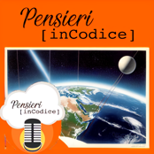</a>
  <a href="PIC76_10.png">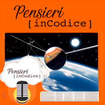</a>
  <a href="PIC76_11.png">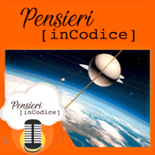</a>
  <a href="PIC76_12.png">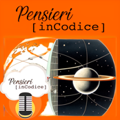</a>
  
  
  
  <a href="PIC76_16.png">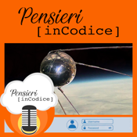</a>

</body>
</html>
